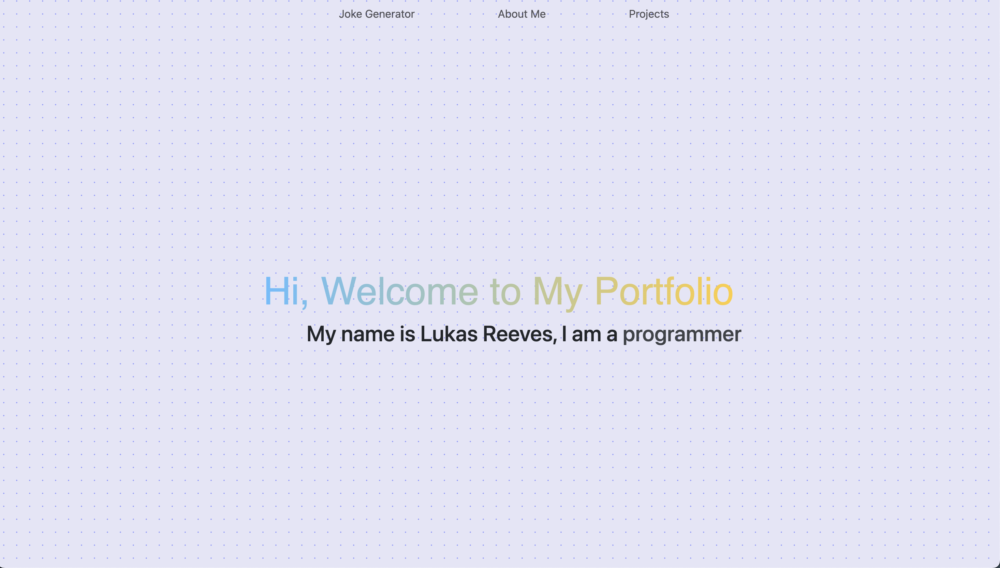

# 🌟 React Portfolio

A portfolio website showcasing my personal projects and AI-powered tools using React, TypeScript, and Vite. 🖥️

🌐 View website: [lukasreeves.com](http://lukasreeves.com)



## ✨ Features

- **Navbar**: This component aids in navigating through the portfolio.
- **Hero Section**: An engaging hero section with gradient text effects. 🌈
- **About Me**: An intuitive "about me" section featuring fading border effects.
- **Projects Section**: Dynamically showcases projects with card hover effects that reveal more details. 📋
- **JokeGenerator**: Delivers random jokes for a good laugh! 😂
- **Footer**: Presents footer details for licensing. 🔖

## 🚀 Getting Started

Here's how you can get the project running on your local machine:

### 📋 Prerequisites

- Bun 🍞 (Download it from [here](https://bun.sh/docs/installation/))

### 🛠️ Installation

1. Clone the repository:
    ```bash
    git clone https://github.com/lureeves/react-portfolio.git
    ```
2. Move into the project directory:
    ```bash
    cd react-portfolio
    ```
3. Install the required dependencies:
    ```bash
    bun install
    ```

### 🖥️ Running the App

Kick off the development server with:

```bash
bun run dev
```

The application should now be live at `http://localhost:5173`.

## 🛠️ Technologies Used

- React.js
- Bootstrap
- TypeScript
- CSS
- HTML

## 🤝 Contributing

Pull requests are heartily welcome. 🤗 For significant changes, kindly open an issue first to discuss your ideas.

## 📜 License

This venture is under the MIT License. Check out the [LICENSE.md](LICENSE.md) file for more info.

## 🙌 Acknowledgements

- Kudos to [OpenAI](https://www.openai.com/) for the AI-enhanced content.
